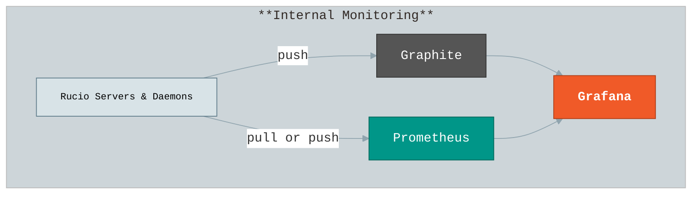
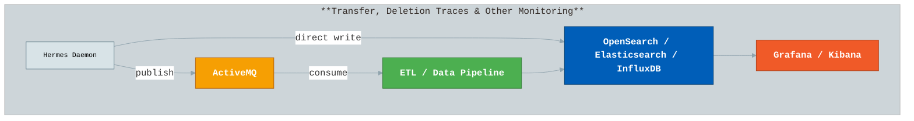
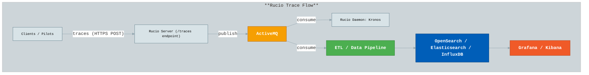
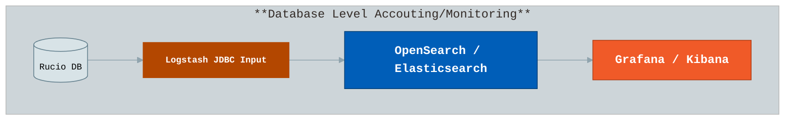

# Rucio Monitoring Guide

Rucio provides multiple monitoring components to observe its internal operations, data transfers, file access, and database state. These components include:

- **Internal Monitoring:** Observing Rucio server and daemon performance.
- **Transfers, Deletion, and More Monitoring:** Tracking transfers, deletions, and other Rucio events.
- **File/Dataset Access Monitoring:** Using traces to monitor client interactions.
- **Database Dump and Visualization:** Extracting database-level metrics for visualization.


## Internal Monitoring

This is to monitor the internals of Rucio servers and daemons, e.g., submission
rate of the conveyor, state of conveyor queues, reaper deletion rate, server
response times, server active session, etc. Metrics are typically categorized as:

- Counters – measure the number of events (e.g., requests processed).
- Timers/Histograms – measure durations of operations (e.g., rule evaluation time, transfer submission time).
- Gauges – measure values that can go up and down (e.g., number of active sessions, queue sizes).



There are two options:

1. Graphite
   
   Metrics are pushed to a Graphite server.
   
     ```cfg
     [monitor]
     # specify the hostname for carbon server
     carbon_server = <hostname>
     carbon_port = 8125
     user_scope = rucio
     ```

2. Prometheus

   Metrics can be scraped by Prometheus or optionally pushed to Prometheus Pushgateway for short-lived processes. Prometheus also supports multiprocess-safe metrics for deployments using multiple threads or Apache MPM subprocesses. Exposed over an HTTP endpoint for scraping `/metrics`. Multiprocess-safe metrics are supported using the PROMETHEUS_MULTIPROC_DIR environment variable.

     ```cfg
     [monitor]
     # Enable Prometheus metrics
     enable_metrics = True
     # Port for Prometheus HTTP server
     metrics_port = 8080
     ```
The used metrics can be found in following links (code search)
- [Counter](https://github.com/search?q=repo%3Arucio%2Frucio+Metrics.Counter&type=code)
- [Gauge](https://github.com/search?q=repo%3Arucio%2Frucio+Metrics.gauge&type=code)
- [Timer](https://github.com/search?q=repo%3Arucio%2Frucio+Metrics.timer&type=code)

[Grafana Dashboard JSON](https://github.com/rucio/rucio/blob/master/tools/monitoring/visualization/rucio-internal.json) for Graphite is given here. 
[Grafana Dashboard JSON](https://github.com/rucio/monitoring-templates/blob/main/prometheus-monitoring/Dashboards/Rucio-Internal.json) for prometheus is given here. 

Note: Dashboard example is just for giving some idea, they might need to be tweaked according to your setup and needs.

## Transfers, Deletion and Other Monitoring
Rucio generates a large volume of operational events for activities such as: transfers, deletions, rule evaluations, replication tasks, etc., originating from daemons like conveyor, reaper, judge, and others.

These events are collected and delivered by the Hermes daemon, which can forward them to message queues or storage backends for further processing, analysis, and storage. According to your storage backend you can use visualization software like Grafana/Kibana.



Different options are shown in figure and described below.

1. Queue-Based Pipelines

     Hermes publishes events to a queue or topic in message queue (ActiveMQ). Multiple consumers can process events independently. Enables real-time, decoupled processing pipelines. These events from ActiveMQ can be consumed by ETL pipelines. These Pipelines allow aggregation, transformation, enrichment, and forwarding to different storage backends of your choice.

     Example pipeline : ActiveMQ -> Logstash -> OpenSearch


      Config for this is described below.
      ```cfg
      [hermes]
      # List of services Hermes should send messages to.
      services_list = activemq

      # Toggle query behavior:
      # True  -> fetch bulk messages for each service individually
      # False -> fetch bulk messages across all services together
      query_by_service = True

      # Bulk retrieval size for each call to the database
      bulk = 1000

      [messaging-hermes]
      # ActiveMQ options
      # List of broker hostnames or DNS aliases
      brokers = amq1.example.com, amq2.example.com
      # Destination queue or topic
      destination = /queue/rucio
      # Use SSL for ActiveMQ connection
      use_ssl = True
      # SSL certificate files (if using SSL)
      ssl_cert_file = /etc/rucio/certs/hermes-client-cert.pem
      ssl_key_file = /etc/rucio/certs/hermes-client-key.pem
      # Virtual host, optional
      broker_virtual_host = /
      # Non-SSL port (used if use_ssl=False)
      nonssl_port = 61613
      # SSL port (used if use_ssl=True)
      port = 61614
      # ActiveMQ username/password (used if use_ssl=False)
      username = 
      password =
      ```
2. Direct Delivery
   
     These options send events directly to storage or alerting systems, bypassing queues.
     Hermes can write events straight to Elasticsearch, OpenSearch, or InfluxDB. In addtion can also deliver events via email which supports custom SMTP servers, credentials, and SSL/TLS.

     Configuration option for each type is described below.

      ```cfg
      # rucio.cfg
      # =========================
      # Hermes Daemon Configuration
      # =========================

      [hermes]
      # List of services Hermes should send messages to.
      # Supported values: influx, elastic, email, activemq
      services_list = elastic, influx, email, activemq

      # Toggle query behavior:
      # True  -> fetch bulk messages for each service individually
      # False -> fetch bulk messages across all services together
      query_by_service = True

      # Bulk retrieval size for each call to the database
      bulk = 1000

      # InfluxDB endpoint for sending aggregated metrics
      influxdb_endpoint = https://influxdb-host:8086/api/v2/write?org=my-org&bucket=my-bucket&precision=ns
      # Token for authenticating to InfluxDB
      influxdb_token = my-secret-influxdb-token

      # Elasticsearch endpoint for sending events
      elastic_endpoint = https://elasticsearch-host:9200/rucio-eic-event/_bulk
      # Optional credentials if Elasticsearch is secured
      elastic_username = admin
      elastic_password = password

      # Email sending options
      send_email = True
      email_from = rucio@cern.ch
      smtp_host = smtp.cern.ch
      smtp_port = 587
      smtp_username = my-smtp-user
      smtp_password = my-smtp-pass
      smtp_usessl = False
      smtp_usetls = True
      smtp_certfile = 
      smtp_keyfile = 
      ```
### Event Types
1. Transfer Events
   ```
   {
     created_at: when the message was created (yyyy-MM-ddTHH:mm:ss.SSSSSS)
     event_type: type of this event (transfer-submitted, \
       transfer-submission_failed, transfer-queued, transfer-failed, \
       transfer-done)
     payload: {
       account: account submitting the request
       activity: activity of the request
       bytes: size of the transferred file (byte)
       checksum-adler: checksum using adler algorithm
       checksum-md5: checksum using md5 algorithm
       created_at: Time when the message was created (yyyy-MM-dd HH:mm:ss.SSSSSS)
       dst-rse: destination rse
       dst-type: type of destination rse (disk, tape)
       dst-url: destination url of the transferred file
       duration: duration of the transfer (second)
       event_type: type of this event (transfer-submitted, \
         transfer-submittion_failed, transfer-queued, \
         transfer-failed, transfer-done)
       file-size: same as bytes
       guid: guid of the transfer
       name: name of transferred file
       previous-request-id: id of previous request
       protocol: transfer protocol
       reason: reason of the failure
       request-id: id of this request
       scope: scope of the transferred data
       src-rse: source rse
       src-type: type of source rse (disk, tape)
       src-url: source file url
       started_at: start time of the transfer (yyyy-MM-dd HH:mm:ss.SSSSSS)
       submitted_at: submission time of the transfer (yyyy-MM-dd HH:mm:ss.SSSSSS)
       tool-id: id of the transfer tool in rucio (rucio-conveyor)
       transfer-endpoint: endpoint holder of the transfer (fts)
       transfer-id: uuid of this transfer
       transfer-link: link of this transfer (in form of fts url)
       transferred_at: done time of this transfer
     }
   }
   ```
2. Deletion Event
   ```
   {
     created_at: when the message was created (yyyy-MM-ddTHH:mm:ss.SSSSSS)
     event_type: type of this event (deletion-done,deletion-failed, deletion-not-found)
     payload: {
       scope: scope of the deleted replica
       name: name of the deleted replica
       rse: rse holding the deleted replica
       file-size: size of the file
       bytes: size of the file
       url: url of the file
       duration: duration of the deletion
       protocol: prococol used in the deletion
       reason: reason of the failure
     }
   }
   ```
3. Rule Event
   ```
    created_at: when the message was created (yyyy-MM-ddTHH:mm:ss.SSSSSS)
    event_type: 'RULE_OK' or 'RULE_PROGRESS'
    payload:{
      'scope': scope.external,
      'name': name,
      'rule_id': rule_id, # only for RULE_OK and RULE_PROGRESS
      'vo': vo # only if not default
      'progress': int #replication progress # only for RULE_PROGRESS
      'dataset_name': dataset_name, # only for LOST
      'dataset_scope': dataset_scope # only for LOST
    }
   ```
4. Dataset Lock Event
   ```
   {
     created_at: when the message was created (yyyy-MM-ddTHH:mm:ss.SSSSSS)
     event_type: 'DATASETLOCK_OK'
     payload: {
       'scope': did_scope,
       'name': did_name,
       'rse': rse,
       'rse_id': rse_id,
       'rule_id': rule_id
       'vo': vo if not default
      }
   }
   ```
There are other event for replicas, dids etc  not stated here.

### Dashboard
[Kibana Dashbaord](https://github.com/rucio/rucio/tree/master/tools/monitoring/visualization) example was given.
[Grafana Dashboard](https://github.com/rucio/monitoring-templates/blob/main/message-monitoring/Dashboards/Rucio-Transfer.json) for transfer for elaticsearch/opensearch example given.

Note: Dashboard example is just for giving some idea, they might need to be tweaked according to your setup and needs. They might be also be on old versions. 

## Traces
The traces are sent by the pilots or the rucio clients whenever a file is downloaded/uploaded. These trace events are sent to the Rucio server via the /traces endpoint using HTTPS POST, where they are forwarded to messaging backends such as ActiveMQ. ActiveMQ acts as the messaging broker, delivering trace events to Kronos daemon. Any consumer like logstash can the be used for relaying traces to data pipelines for further processing if needed. And then directly or after processing be sent to storage backends such as OpenSearch, Elasticsearch, or InfluxDB, which allow querying, aggregation, and analytics. Finally, visualization tools like Grafana and Kibana can be used.

This is shown in figure below. Schemas of the traces can be found in [trace.py](https://github.com/rucio/rucio/blob/master/lib/rucio/core/trace.py) which can be used for dashboards.




## Rucio database dumping
Database-level monitoring extracts different information directly from the Rucio database. This includes insights such as RSE usage statistics, account quotas, and other metadata relevant to experiments. These data are periodically queried and exported to external storage backends for visualization and long-term monitoring.

Some Logstash pipeline definitions are given [here](https://github.com/rucio/rucio/tree/master/tools/monitoring/logstash-pipeline). These example pipelines use the Logstash JDBC input plugin to connect to the Rucio PostgreSQL database, execute SQL queries, and extract structured data periodically. The retrieved records are then sent to Elasticsearch but can be changed to other storage backends such as OpenSearch.



A typical Logstash configuration consists of three sections — input, filter, and output. For example, the input section defines the PostgreSQL connection and SQL query to fetch data:
```
input {
   jdbc {
      jdbc_connection_string => ""
      jdbc_user => ""
      jdbc_password => ""
      jdbc_driver_library => "/usr/share/logstash/java/postgresql-42.2.6.jar"
      jdbc_driver_class => "org.postgresql.Driver"
      statement => "SELECT rses.rse, rse_usage.source, rse_usage.used, rse_usage.free, rse_usage.files FROM rse_usage INNER JOIN rses ON rse_usage.rse_id=rses.id WHERE rse_usage.files IS NOT NULL AND rse_usage.files!=0;"
      schedule => "0 0 * * *"
   }
}
```
The output section defines where the extracted data are delivered. In most deployments, these are indexed into OpenSearch or Elasticsearch for analytics dashboards in Grafana or Kibana:
```
output {
  elasticsearch {
    hosts => ["http://elasticsearh:9200"]
    action => "index"
    index => "rucio_account"
    user => "elastic"
    password => "password"
  }
}
```

Some [Kibana dashboard](https://github.com/rucio/rucio/tree/master/tools/monitoring/visualization/db_dump) example given.
[Grafana dashboard](https://github.com/rucio/monitoring-templates/blob/main/logstash-monitoring/Dashboards/Rucio-Storage.json) example for rse given.
Note: Dashboard example is just for giving some idea, they might need to be tweaked according to your setup and needs. They might be also be on old versions. 
