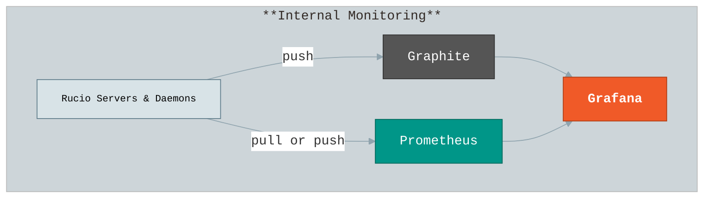
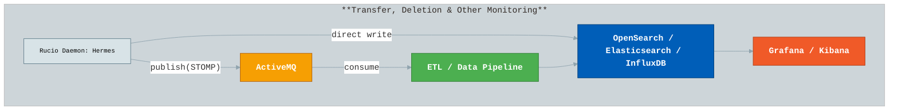
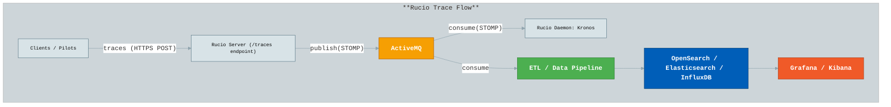
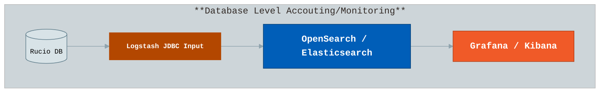
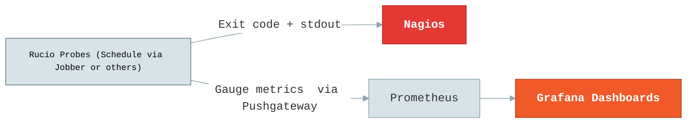

# Rucio Monitoring Guide

Rucio provides multiple monitoring components to observe its internal operations, data transfers, file access, and database state. These components include:

- [**Internal Monitoring**](#internal-monitoring): Observing Rucio server and daemon performance.
- [**Transfers, Deletion, and Other Monitoring**](#transfers-deletion-and-other-monitoring): Tracking transfers, deletions, and other Rucio events.
- [**File/Dataset Access Monitoring**](#traces): Using traces to monitor client interactions.
- [**Database Dump and Visualization**](#rucio-database-dump): Extracting database-level metrics for visualization.
- [**Probes**](#rucio-monitoring-probes): Automated checks and using Nagios or Prometheus Pushgateway.


## Internal Monitoring

This is to monitor the internals of Rucio servers and daemons, e.g., submission
rate of the conveyor, state of conveyor queues, reaper deletion rate, server
response times, server active session, etc. Metrics are typically categorized as:

- Counters – measure the number of events (e.g., requests processed).
- Timers/Histograms – measure durations of operations (e.g., rule evaluation time, transfer submission time).
- Gauges – measure values that can go up and down (e.g., number of active sessions, queue sizes).



There are two options:

1. Graphite
   
   Metrics are pushed to a Graphite server.
   
     ```cfg
     [monitor]
     # specify the hostname for carbon server
     carbon_server = <hostname>
     carbon_port = 8125
     user_scope = rucio
     ```

2. Prometheus

   Metrics can be scraped by Prometheus or optionally pushed to Prometheus Pushgateway for short-lived processes. Prometheus also supports multiprocess-safe metrics for deployments using multiple threads or Apache MPM subprocesses. Exposed over an HTTP endpoint for scraping `/metrics`. Multiprocess-safe metrics are supported using the PROMETHEUS_MULTIPROC_DIR environment variable.

     ```cfg
     [monitor]
     # Enable Prometheus metrics
     enable_metrics = True
     # Port for Prometheus HTTP server
     metrics_port = 8080
     ```
The used metrics can be found in following links (code search)
- [Counter](https://github.com/search?q=repo%3Arucio%2Frucio+Metrics.Counter&type=code)
- [Gauge](https://github.com/search?q=repo%3Arucio%2Frucio+Metrics.gauge&type=code)
- [Timer](https://github.com/search?q=repo%3Arucio%2Frucio+Metrics.timer&type=code)

[Grafana Dashboard JSON](https://github.com/rucio/monitoring-templates/blob/main/prometheus-monitoring/Dashboards/Rucio-Internal.json) for Prometheus is given here. 


## Transfers, Deletion and Other Monitoring
Rucio generates a large volume of operational events for activities such as: transfers, deletions, rule evaluations, replication tasks, etc., originating from daemons like conveyor, reaper, judge, and others.

These events are collected and delivered by the Hermes daemon, which can forward them to message queues or storage backends for further processing, analysis, and storage. According to your storage backend you can use visualization software like Grafana/Kibana.



Different options are shown in figure and described below.

1. Queue-Based Pipelines

     Hermes publishes events to a queue or topic in message queue (like ActiveMQ) via STOMP. Multiple consumers can process events independently, which enables real-time, decoupled processing pipelines. These events from ActiveMQ can be consumed by ETL pipelines. These Pipelines allow aggregation, transformation, enrichment, and forwarding to different storage backends of your choice.

     Example pipeline : ActiveMQ -> Logstash -> OpenSearch


      Config for this is described below.
      ```cfg
      [hermes]
      # List of services Hermes should send messages to.
      services_list = activemq

      # Toggle query behavior:
      # True  -> fetch bulk messages for each service individually
      # False -> fetch bulk messages across all services together
      query_by_service = True

      # Bulk retrieval size for each call to the database
      bulk = 1000

      [messaging-hermes]
      # ActiveMQ options
      # List of broker hostnames or DNS aliases
      brokers = amq1.example.com, amq2.example.com
      # Destination queue or topic
      destination = /queue/rucio
      # Use SSL for ActiveMQ connection
      use_ssl = True
      # SSL certificate files (if using SSL)
      ssl_cert_file = /etc/rucio/certs/hermes-client-cert.pem
      ssl_key_file = /etc/rucio/certs/hermes-client-key.pem
      # Virtual host, optional
      broker_virtual_host = /
      # Non-SSL port (used if use_ssl=False)
      nonssl_port = 61613
      # SSL port (used if use_ssl=True)
      port = 61614
      # ActiveMQ username/password (used if use_ssl=False)
      username = 
      password =
      ```

2. Direct Delivery
   
     These options send events directly to storage or alerting systems, bypassing queues.
     Hermes can write events straight to Elasticsearch, OpenSearch, or InfluxDB. In addition can also deliver events via email which supports custom SMTP servers, credentials, and SSL/TLS.

     Configuration option for each type is described below.

      ```cfg
      # rucio.cfg
      # =========================
      # Hermes Daemon Configuration
      # =========================

      [hermes]
      # List of services Hermes should send messages to.
      # Supported values: influx, elastic, email, activemq
      services_list = elastic, influx, email, activemq

      # Toggle query behavior:
      # True  -> fetch bulk messages for each service individually
      # False -> fetch bulk messages across all services together
      query_by_service = True

      # Bulk retrieval size for each call to the database
      bulk = 1000

      # InfluxDB endpoint for sending aggregated metrics
      influxdb_endpoint = https://influxdb-host:8086/api/v2/write?org=my-org&bucket=my-bucket&precision=ns
      # Token for authenticating to InfluxDB
      influxdb_token = my-secret-influxdb-token

      # Elasticsearch endpoint for sending events
      elastic_endpoint = https://Elasticsearch-host:9200/rucio-eic-event/_bulk
      # Optional credentials if Elasticsearch is secured
      elastic_username = admin
      elastic_password = password

      # Email sending options
      send_email = True
      email_from = rucio@cern.ch
      smtp_host = smtp.cern.ch
      smtp_port = 587
      smtp_username = my-smtp-user
      smtp_password = my-smtp-pass
      smtp_usessl = False
      smtp_usetls = True
      smtp_certfile = 
      smtp_keyfile = 
      ```
### Event Types
Different event types are created
  - Transfers: `transfer-submitted`, `transfer-submission_failed`, `transfer-queued`, `transfer-failed`, `transfer-done`
  - Deletions: `deletion-done`, `deletion-not-found`, `deletion-failed`
  - Rules: `RULE_OK`, and `RULE_PROGRESS`
  - Locks: `DATASETLOCK_OK`
  - DIDs: `CREATE_CNT` and `CREATE_DTS`
  - Replicas: `INCOMPLETE` and `ERASE`


The structure of messages table which is extracted by Hermes is:
```json
{
  "id": "UUID4",
  "services": "<service_name>",
  "event_type": "<event_type>",
  "created_at": "yyyy-MM-dd HH:mm:ss.SSSSSS",
  "payload": {},
  "payload_nolimit": {},
}
```
where:
- `id`: UUID string
- `event_type`: string describing the event_type listed before
- `payload`: small JSON object (max 4000 chars), structure varies by event type
- `payload_nolimit`: optional large JSON object. Only if payload larger than 4000 characters
- `services`: string identifying the service. (elastic, activemq, influx)
- `created_at`: When the message was created. ISO 8601 timestamps


To quickly inspect the payloads of these event types:
```sql
SELECT id, created_at, payload
FROM messages
WHERE event_type = '<event_type>'
ORDER BY created_at DESC
LIMIT 2;
```
replace `event_type` with actual name that you want to inspect. We can also check `messages_history` table.

### Format of Messages Delivered by Hermes 
The final format of the message is determined by the destination service, as Hermes transforms the raw database message into the required wire protocol for external systems.

- ActiveMQ (STOMP Message): The body is a streamlined JSON object containing only `event_type`, `payload`, and `created_at`. The message uses STOMP headers to set the event_type and flag the message as persistent.

- Elasticsearch / OpenSearch (Bulk API): Hermes sends the raw database JSON message (including `id` and `services`) as a document using Bulk API format (via a POST request).

- InfluxDB (Line Protocol): Hermes performs on-the-fly aggregation of transfers and deletions, counting successes/failures and bytes. It does not send the raw event JSON. The final format is the InfluxDB Line Protocol, which consists of a single text line combining the measurement, tags (e.g., RSE, activity), fields (e.g., `nb_done=10`), and a timestamp.


Example Grafana dashboard for transfer is provided [here](https://github.com/rucio/monitoring-templates/blob/main/message-monitoring/Dashboards/Rucio-Transfer.json)

> **Note**: Please make changes to the dashboard according to your setup and needs.

## Traces
Rucio clients can send trace events on every file upload or download. These are posted to the `/traces` endpoint and forwarded to a message broker such as ActiveMQ via STOMP. Messages are consumed by Rucio’s Kronos daemon or by external consumers.

This is shown in figure below. Schemas of the traces can be found in [`trace.py`](https://github.com/rucio/rucio/blob/master/lib/rucio/core/trace.py) which can be used for dashboards.




## Rucio database dump
Database-level monitoring extracts different information directly from the Rucio database. This includes insights such as RSE usage statistics, account quotas, and other metadata relevant to experiments. These data are periodically queried and exported to external storage backends for visualization and long-term monitoring.

Some example Logstash pipeline definitions are given [here](https://github.com/rucio/monitoring-templates/blob/main/logstash-monitoring/Pipelines/pipelines.yml). These example pipelines use the Logstash JDBC input plugin to connect to the Rucio PostgreSQL database, execute SQL queries, and extract structured data periodically. The retrieved records are then sent to Elasticsearch but can be changed to other storage backends such as OpenSearch. The following diagram shows the high-level flow for database-level monitoring using Logstash.

> **Note** : While this example uses Logstash, you can use other data collector options like [fluentd](https://www.fluentd.org/) with [plugin](https://github.com/fluent/fluent-plugin-sql) depending on your requirements.



A typical Logstash configuration consists of three sections — input, filter, and output. For example, the input section defines the PostgreSQL connection and SQL query to fetch data:
```
input {
   jdbc {
      jdbc_connection_string => "jdbc:postgresql://host:5432/<dbname>""
      jdbc_user => ""
      jdbc_password => ""
      jdbc_driver_library => "/usr/share/logstash/java/postgresql-<version>.jar"
      jdbc_driver_class => "org.postgresql.Driver"
      statement => "SELECT rses.rse, rse_usage.source, rse_usage.used, rse_usage.free, rse_usage.files FROM rse_usage INNER JOIN rses ON rse_usage.rse_id=rses.id WHERE rse_usage.files IS NOT NULL AND rse_usage.files!=0;"
      schedule => "0 0 * * *"
   }
}

filter {
   # Placeholder for transformations or enrichments
   # Examples:
   # - Add computed fields
   # - Rename fields
   # - Convert units (e.g., bytes to GB)
   # - Drop unwanted fields
}


output {
  elasticsearch {
    hosts => ["http://elasticsearch:9200"]
    action => "index"
    index => "rucio_rse"
    user => "elastic"
    password => "password"
  }
}
```
Few points:
- `jdbc_driver_library`: Can be downloaded from [jdbc.postgresql.org](https://jdbc.postgresql.org/), choose the version that you want to use and enable that in Logstash.
- `schedule`: Defines how often the query runs (Cron-like syntax).
- `output`: Defines where the extracted data are delivered. In most deployments, these are indexed into OpenSearch or Elasticsearch for analytics dashboards in Grafana or Kibana.
- `filter`: This is optional. It helps in preprocessing your data before indexing


[Grafana dashboard](https://github.com/rucio/monitoring-templates/blob/main/logstash-monitoring/Dashboards/Rucio-Storage.json) example for RSE given. 

## Rucio Monitoring Probes

Rucio provides a collection of **monitoring probes** that check the different status metrics of the Rucio.
The list of probes is available [here](https://github.com/rucio/probes/tree/master/common) probes shared across experiments. Also can create experiment-specific probes for custom monitoring like [ATLAS](https://github.com/rucio/probes/tree/master/atlas) and [CMS](https://github.com/rucio/probes/tree/master/cms).

Rucio provides a prebuilt container on [Docker Hub](https://hub.docker.com/r/rucio/probes) that includes:

- All dependencies for running the probes.
- A lightweight **Jobber** daemon for scheduling probe execution.
- The full Rucio probe repository. Custom probes can be added by introducing them to your own Rucio instance.

The container can push results either to a **Prometheus Pushgateway** or export data for **Nagios** alerting.



Probe Execution Workflow is:

- **Probes** are Python scripts under `rucio/probes/`.
- **Jobber** acts as a cron-like scheduler inside the container.
- **Output options:**
  - **Prometheus Pushgateway:** for time-series metrics. Alerts can be added with [Prometheus](https://prometheus.io/docs/alerting/latest/alertmanager/) and [Grafana](https://grafana.com/docs/grafana/latest/alerting/set-up/configure-alertmanager/) alert management.
  - **Nagios:** Used mainly as a cron-style runner where exit codes trigger Nagios alerts, while probe metrics are sent to Prometheus.

To make use of Prometheus functionality, make sure your `rucio.cfg` inside the container with the probes has the extra sections and options:

```cfg
[monitor]
prometheus_servers = "https://prometheuserver:port"
prometheus_prefix = "" # default empty
prometheus_labels = "" # default empty
```

For adding cron-like scheduling for each probe in jobber, make sure you have added needed config in [dot-jobber](https://github.com/rucio/containers/blob/master/probes/dot-jobber). An example config is given below, running the probes `check_expired_dids` and `check_stuck_rules`. This config assumes your probes are in the top level directory of the container. 

```yaml
version: 1.4
jobs:
  - name: CheckExpiredDIDs
    cmd: ./check_expired_dids
    time: '*/5 * * * *'    # every 5 minutes
    onError: Continue
  - name: CheckStuckRules
    cmd: ./check_stuck_rules
    time: '0 * * * *'      # hourly
    onError: Continue
```
