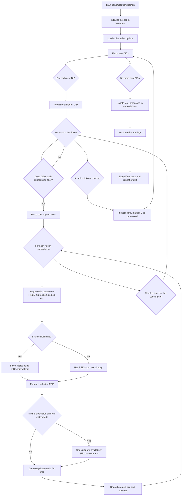

# Rucio Transmogrifier Daemon

## Purpose

The **transmogrifier daemon** in Rucio is responsible for automatically creating and managing **replication rules** for new DIDs (Data Identifiers) according to user-defined **subscriptions**. This automation ensures that new data is distributed across storage endpoints as soon as it appears, following the policies and patterns defined by users.

---

## How It Works

### Step-by-Step Behaviour

1. **Initialization**
    - The daemon starts, sets up logging, threads, and heartbeats.
    - It checks the database schema for compatibility.

2. **Loading Subscriptions**
    - Active subscriptions are loaded and validated.
    - Subscriptions contain filters (which data to match) and replication rules (where and how much to replicate).

3. **Fetching New DIDs**
    - The daemon queries for new DIDs (datasets or containers) that have not yet been processed.

4. **Matching DIDs Against Subscriptions**
    - For each new DID, it fetches metadata and checks against all subscription filters.
    - Each filter can include scope, name patterns, account, DID type, file size limits, and more.

5. **Processing Matching Subscriptions**
    - For each matching subscription and DID:
        - Parses the subscription’s replication rules.
        - Prepares rule parameters (number of copies, RSE expressions, activity, etc.).
        - Handles **split** and **chained** logic for advanced placement scenarios.

6. **Selecting RSEs (Storage Endpoints)**
    - Depending on rule logic:
        - **Direct:** Uses the RSEs specified in the rule.
        - **Split/Chained:** Calls algorithms to dynamically select RSEs based on previous rule placements or specific logic.

7. **Rule Creation**
    - Attempts to create the required replication rules for each selected RSE.
    - Handles errors, blocklisted RSEs, and retry logic.

8. **Marking & Updating**
    - Successfully processed DIDs are marked to avoid reprocessing.
    - Updates the subscription’s metadata (e.g., `last_processed` timestamp).

9. **Metrics and Logging**
    - The daemon records metrics on processing counts, errors, durations, and more for monitoring.

10. **Loop or Exit**
    - If running in continuous mode, the daemon sleeps and repeats.
    - If running in one-shot mode, it exits.

---

## Algorithms for Chained Rules

Chained subscriptions enable advanced, context-aware data placement strategies. The `algorithm` parameter determines how the next RSE(s) are selected based on previous rules.

| Algorithm         | Description                                                      | Typical Use Case                                   |
|-------------------|------------------------------------------------------------------|----------------------------------------------------|
| `associated_site` | Select an associated RSE/site from a previous rule's site using the `ASSOCIATED_SITES` attribute. The `associated_site_idx` parameter determines which associated site to use. | Chaining copies across logically linked sites (e.g., for redundancy or workflow steps). |
| `exclude_site`    | Select an RSE that is **not** the site used by the parent rule (using the `site` attribute to exclude). | Ensuring that different copies are placed at physically separate sites.                 |

- Both algorithms are only valid for rules with split logic and a single copy.
- Errors are raised if required parameters are missing or misconfigured.

---

## Flowchart: Transmogrifier Behaviour

---

## Key Concepts

- **DID**: Data Identifier (can be a file, dataset, or container).
- **Subscription**: User-defined pattern and rules for automatic data placement.
- **Replication Rule**: Instruction for Rucio to place a copy of a DID on specified RSEs.
- **RSE**: Rucio Storage Element (storage endpoint, e.g., a data center or cloud bucket).
- **Split/Chained Logic**: Advanced methods for spreading or chaining rules across multiple sites, using algorithms.

---

## Summary

The transmogrifier daemon is central to Rucio’s automated data management, ensuring that new data is promptly and correctly distributed according to organizational policies and user-defined subscriptions. Its sophisticated logic—including split, chained, and algorithmic rule selection—supports even the most advanced data placement strategies, while robust error handling and metrics allow for reliable, scalable operation.

---

