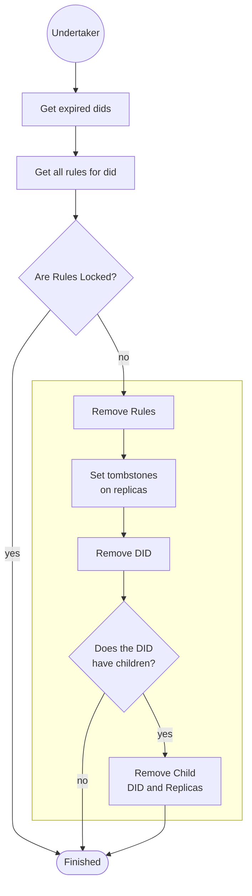
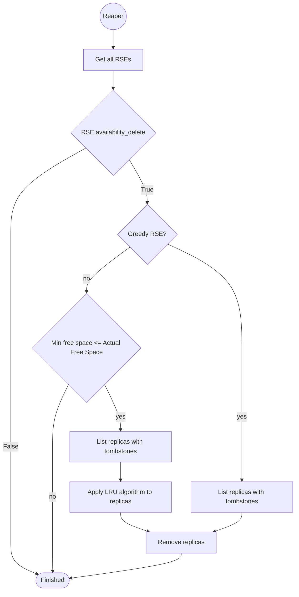

Deletion in Rucio can be performed in broadly two ways.

- Rule based deletion:

    Each rule has a corresponding lifetime associated with it (default is None). The attribute `expires_at` of the rule is the time when the lifetime is set plus the lifetime associated with the rule.
    Additionally each rule can be `locked` for additional protection. If a rule is locked the rule is protected from expiration.
    The `Judge-cleaner` daemon is responsible for handling expired rules. If an expired rule is not locked it sets `tombstones` on all replicas not covered by the rule anymore (or any other rule). These replicas then become eligible for deletion.

- DID based deletion:

    Additionally, each DID also has a lifetime associated with it (default is None). The metadata `expires_at` of the DID is calculated similarly to a rule.
    The `Undertaker` daemon is responsible for handling expired DIDs. The daemon checks if none of the associated rules to the DID are locked, if not it removes all rules of the DID (see section above). The DID itself is then removed from the catalog.
    If all the DIDs in a collection type dataset are deleted, the collection itself is not removed unless it also has an expired lifetime.

**The DID expiration overrules the rule expiration. But the locked rules are protected.**

After the tombstone is set for replicas, the actual data deletion is done by the `Reaper` daemon. The reaper physically deletes the tombstoned replicas from storage.
The deletion service supports two different modes: greedy and non-greedy.

- Greedy
    
    The reaper daemon gets all the replicas with tombstone in the RSE and immediately deletes all replicas. 
    
- Non-greedy

    The reaper daemon first checks if the free space is needed in the RSE. The needed free space is the difference of minimum free space (attribute set for RSE) and actual free space in RSE. Deletion only occurs once free space is needed.
    Deletions are processed by Least Recently Used (LRU) algorithm, thus oldest accessed (tombstoned) replicas are deleted first.

