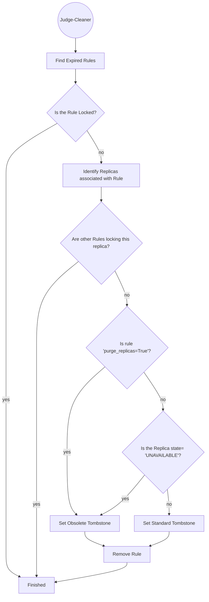
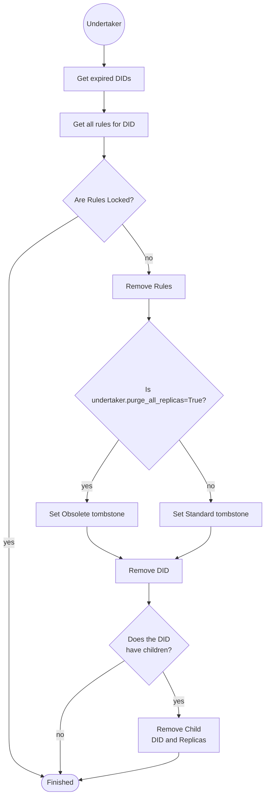
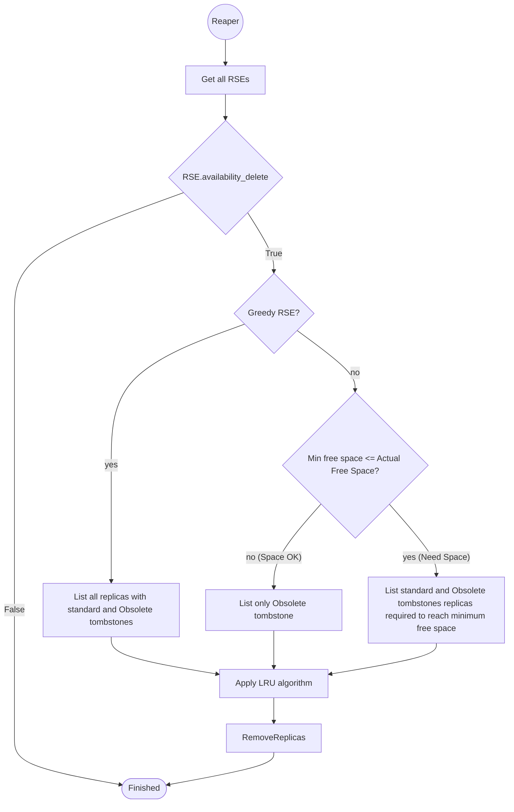

Deletion in Rucio can be performed in broadly two ways.

## [Rule-based deletion](#rule-based-deletion)
    Each rule has an associated lifetime (default: `None`). The `expires_at` attribute of a rule is computed as the time when the lifetime was set plus the given lifetime.
    Rules can also be `locked` for protection. Locked rules are excluded from expiration.
    The `Judge-cleaner` daemon is responsible for handling expired rules. When a rule expires and is not locked, it is deleted by the daemon. When the rule is deleted, a tombstone is set on replicas that are no longer covered by any other rules.

    Two types of tombstones are set:

    - Obsolete Tombstone (1970-01-01):
      Set when `purge_replicas=True` or when the replica state is `UNAVAILABLE`. These replicas are prioritized for immediate deletion.
  
    - Standard Tombstone:
      Set using the replica’s `accessed_at` (or `created_at`) timestamp. This supports Least Recently Used (LRU) based cleanup.

    :::note

      A tombstone can be in the future (e.g. intermediate replicas in multi-hop transfers) or the replica may be used as a source in an active transfer. These are not eligible for deletion.

    :::

    See the [Judge-cleaner flow diagram](#judge-cleaner-flow).

## [DID-based deletion](#did-based-deletion)
    Each DID also has an associated lifetime (default: `None`). The DID `expires_at` metadata is computed in a similar way to rules.
    The `Undertaker` daemon processes expired DIDs. It first checks whether any associated rules are locked. If no locked rules exist, all rules for the DID are removed (see [Rule-based deletion](#rule-based-deletion)). The DID is then removed from the catalog.
    If all DIDs in a dataset are deleted, the dataset itself is not removed unless its lifetime has also expired.
    If `undertaker.purge_all_replicas = True`, the Undertaker sets an Obsolete tombstone on replicas. Otherwise, it sets a standard tombstone.
    Users may also [manually set a tombstone](pathname:///html/client_api/replicaclient.html#rucio.client.replicaclient.ReplicaClient.set_tombstone) via client tools, which directly marks a replica as obsolete.
    See the [Undertaker flow diagram](#undertaker-flow).

:::note

DID expiration takes precedence over rule expiration. However, locked rules are always protected.

:::

After tombstones are set, physical deletion is performed by the `Reaper` daemon, which removes data from storage.
The deletion service supports two different modes: greedy and non-greedy.

- Greedy

    The Reaper deletes all replicas with eligible tombstone .

- Non-greedy

    The reaper daemon first checks if the free space is needed in the RSE. The needed free space is the difference of minimum free space (set with `Client().add_rse_attribute(rse=<RSE>, key='MinFreeSpace', value=<limit in bytes>)`) and actual free space in RSE.

    - If space is not needed: Only Obsolete replicas are eligible for deletion.
    - If space is needed: Both obsolete and standard tombstoned replicas are considered, and deletion follows an LRU strategy. Obsolete replicas are naturally deleted first as they have the oldest timestamps.

See the [Reaper flow diagram](#reaper-flow).

## Judge-cleaner Flow

```mermaid
flowchart TD
    J((Judge-Cleaner)) --> 1[Find Expired Rules]
    1 --> 2{Is the Rule Locked?}
    2 -- "yes" --> Finished
    2 -- "no" --> 3[Identify Replicas associated with Rule]
    3 --> 4{Are other Rules locking this replica?}
    4 -- "yes" --> Finished
    4 -- "no" --> 5{Is rule 'purge_replicas=True'?}
    5 -- "yes" --> SetObsolete["`Set Obsolete Tombstone`"]
    5 -- "no" --> 6{Is the Replica state= 'UNAVAILABLE'?}
    6 -- "yes" --> SetObsolete
    6 -- "no" --> SetStandard["`Set Standard Tombstone`"]
    SetObsolete --> 7[Remove Rule]
    SetStandard --> 7[Remove Rule]
    7[Remove Rule] --> Finished
```

## Undertaker Flow

```mermaid
flowchart TB
    A((Undertaker)) --> 1[Get expired DIDs]
    1 --> 2[Get all rules for DID]
    2 --> D{Are Rules Locked?}

    D -- "yes" --> f([Finished])
    D -- "no" --> sub1[Remove Rules]

    sub1 --> PurgeCheck{Is undertaker.purge_all_replicas=True?}

    PurgeCheck -- "yes" --> SetObsolete["`Set Obsolete tombstone`"]

    PurgeCheck -- "no" --> SetStandard["`Set Standard tombstone`"]

    SetObsolete --> sub3[Remove DID]
    SetStandard --> sub3

    sub3 --> sub4{"`Does the DID
                    have children?`"}
    sub4 -- "yes" --> sub5["`Remove Child
                            DID and Replicas`"]

    sub4 -- "no" --> f
    sub5 --> f
```

## Reaper Flow

```mermaid
graph TD
    R((Reaper)) --> RSEs[Get all RSEs]
    RSEs --> D1{RSE.availability_delete}
    D1 -- "False" --> f([Finished])
    D1 -- "True" --> Greedy_RSE{Greedy RSE?}

    %% Greedy RSE Logic
    Greedy_RSE -- "yes" --> j[List all replicas with standard and Obsolete tombstones]
    j--> id4[Apply LRU algorithm]
    %% Non-greedy RSE Logic (Updated for Obsolete Replicas)
    Greedy_RSE -- "no" --> MinFreeSpace{Min free space <= Actual Free Space?}

    MinFreeSpace -- "no (Space OK)" --> i_obs[List only Obsolete tombstone]
    MinFreeSpace -- "yes (Need Space)" --> i_all[List standard and Obsolete tombstones replicas required to reach minimum free space]

    i_obs --> id4
    i_all --> id4

    id4 --> RemoveReplicas
    RemoveReplicas --> f
```
